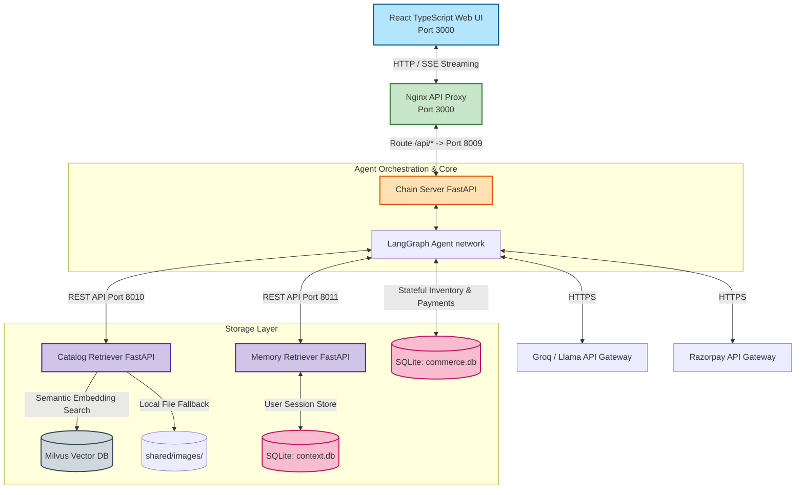
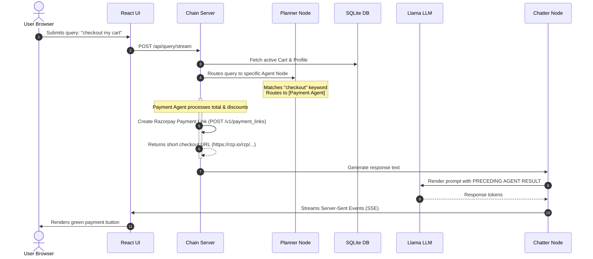
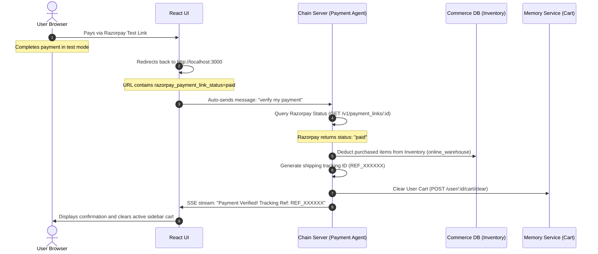

# Retail Shopping Assistant: Architecture & Workflow Guide

This document outlines the system architecture, service maps, databases, and request workflows for the Retail Shopping Assistant application.

---

## 1. System Architecture Diagram

The application consists of a React UI frontend, an Nginx API gateway, three Python microservices (FastAPI), a Milvus vector database for visual discovery, SQLite relational databases, and a LangGraph-orchestrated LLM agent network.

---

## 2. Relational Database Schemas

### A. Memory Retriever Database (`context.db`)
Stores active session context, summarized chat history, and the stateful shopping cart session per user.

| Table Name | Primary Key | Columns | Purpose |
| :--- | :--- | :--- | :--- |
| `cart_items` | `id` (Auto-increment) | `user_id` (INT), `item` (VARCHAR), `amount` (INT), `price` (FLOAT) | Tracks items currently in the user's active shopping cart session. |
| `summaries` | `user_id` | `summary` (TEXT), `updated_at` (TIMESTAMP) | Holds summarized conversation context to feed the LLM memory. |

### B. Commerce Database (`commerce.db`)
Maintains catalog inventory levels, seeded customer profiles, payment stub records, and discount rules.

| Table Name | Primary Key | Columns | Purpose |
| :--- | :--- | :--- | :--- |
| `inventory_items` | `sku` | `name` (VARCHAR), `online_warehouse` (INT), `store_downtown` (INT), `store_suburbs` (INT) | Tracks physical stock levels across warehouses and storefronts. |
| `customer_profiles` | `customer_id` | `name`, `email`, `loyalty_tier`, `loyalty_points`, `purchase_history` (JSON string) | Contains user loyalty points and transaction history. |
| `coupon_rules` | `code` | `discount_percentage`, `min_order_value` | Defines active coupons (e.g. WELCOME10, GOLD20). |
| `payments_stub` | `id` | `payment_method`, `card_number_suffix`, `upi_id`, `gift_card_code`, `balance`, `status` | Contains mock balances for card/UPI/gift card stub test validation. |

---

## 3. End-to-End Request Workflow

The workflow diagram below details the path of a query from frontend submission to final streaming delivery.

---

## 4. Post-Payment Automation Workflow

How the system handles stock decrementing and cart clearing after successful payment verification.

